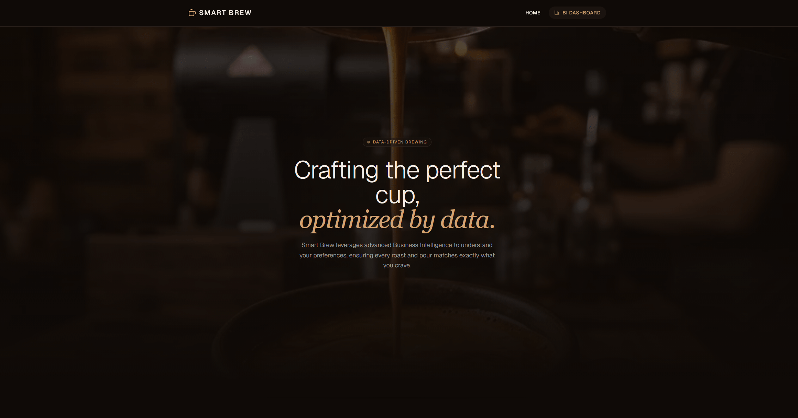
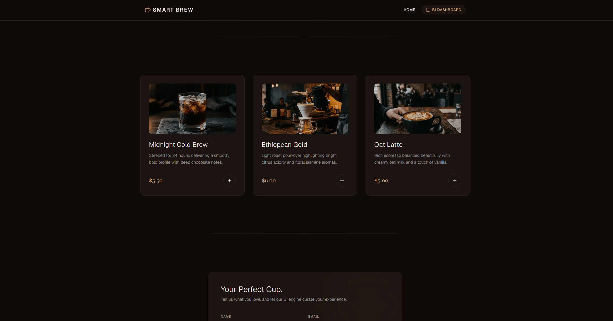
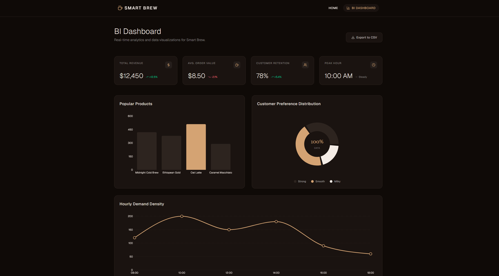
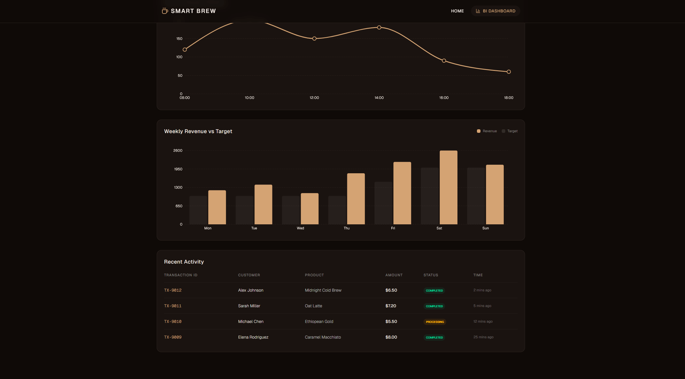
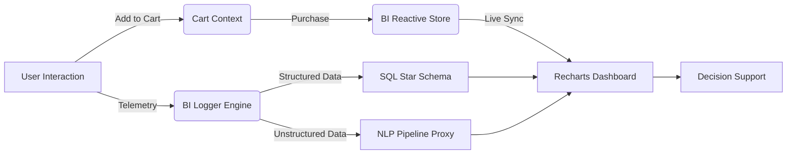

# ☕ Smart Brew - Data-Driven Coffee Experience

> *Where premium coffee meets Business Intelligence.*

| Landing Page | Product Telemetry |
| :---: | :---: |
|  |  |
| **BI Analytics Overview** | **Admin Data Control** |
|  |  |


---

## 📑 Executive Summary

**Smart Brew** is not merely a digital storefront for a boutique coffee shop; it is engineered as a real-time **data generation and telemetry hub**. 
Designed with an emphasis on minimalist aesthetics and high-performance data pipelines, the platform captures granular user interactions and preferences. This telemetry is immediately formatted into structured Business Intelligence (BI) payloads, enabling data-driven decision-making, inventory optimization, and advanced customer segmentation.

---

## 📂 Detailed Folder Structure

The project utilizes the Next.js 15 App Router architecture, cleanly separating UI components, BI logic, and simulated data layers.

```text
.
├── src/
│   ├── app/
│   │   ├── api/
│   │   │   └── log/
│   │   │       └── route.ts  # Backend API to forward client telemetry to Vercel Server Logs
│   │   ├── dashboard/ 
│   │   │   └── page.tsx      # BI Dashboard UI & Real-time Analytics Rendering
│   │   ├── globals.css       # Core CSS, Tailwind configuration, and Theme Variables
│   │   ├── layout.tsx        # Root layout, CartProvider wrapper, Global overlays
│   │   └── page.tsx          # Main Landing Page (Telemetry generation endpoint)
│   ├── components/
│   │   ├── CartDrawer.tsx    # Glassmorphism side drawer with quantity controls
│   │   ├── CartIcon.tsx      # Floating cart button with animated badge counter
│   │   ├── CustomerForm.tsx  # Captures Structured & Unstructured preference data
│   │   ├── HeroSection.tsx   # Premium entry point 
│   │   ├── Navbar.tsx        # Global navigation with cart badge
│   │   ├── ProductList.tsx   # Product catalog & Interaction tracking (Clicks, Views)
│   │   ├── SuccessModal.tsx  # Premium purchase confirmation with confetti effect
│   │   └── Toaster.tsx       # Modern, glassmorphism notification system
│   ├── context/
│   │   └── CartContext.tsx   # Global cart state management (items, quantities, totals)
│   ├── data/
│   │   └── mock-bi-data.ts   # Simulated analytical data for dashboard visualizations
│   └── lib/
│       ├── bi-logger.ts      # Core BI Telemetry Engine & Schema definitions
│       ├── bi-store.ts       # Reactive pub/sub store bridging Cart ↔ Dashboard
│       └── utils.ts          # Utility functions
└── package.json              # Project dependencies and scripts
```

---

## ⚙️ Functional Documentation

### Pages
- **`/app/page.tsx` (Landing)**: Serves as the primary touchpoint for data generation. It hosts the product catalog and customer preference forms, acting as the frontend sensor for the BI pipeline.
- **`/app/dashboard/page.tsx`**: The analytical consumption layer. It visualizes aggregated data metrics using `recharts` with **real-time reactivity** — charts update instantly when purchases are made. Features a direct **Export to CSV** function for Data Portability.

### Core Components
- **`ProductList` & `ProductCard`**: Implements intersection observers and click handlers to log `VIEW` and `ADD_TO_CART` events. Integrates with CartContext to add items to the shopping cart with visual feedback.
- **`CustomerForm`**: A dual-purpose data collection interface. It captures strictly typed enumerations (Structured Data) alongside open-text fields (Unstructured Data) for NLP pipelines.
- **`CartDrawer`**: A glassmorphism side panel (animated via `framer-motion`) that displays cart items with quantity adjustment (+/-) buttons and remove (trash) controls. Includes a "Complete Purchase" CTA.
- **`CartIcon`**: A floating action button (bottom-right) with an animated badge showing the current item count. Includes a pulse ring animation when items are present.
- **`SuccessModal`**: A premium centered modal with blurred backdrop that appears on purchase completion. Fires a `canvas-confetti` burst in the coffee brand palette.

### Cart System (`/context/CartContext.tsx`)
A React Context-based global state manager that tracks:
- Cart items with id, name, price, image, and quantity.
- Computed `totalItems` and `totalPrice`.
- Drawer and modal visibility state.
- Fires BI events at key lifecycle points: `ADD_TO_CART`, `PURCHASE_COMPLETED`, and `CART_ABANDONED` (on tab close with items in cart).

### BI Engine (`/lib/bi-logger.ts`)
The telemetry engine acts as an interceptor. Instead of direct database writes, it formats interactions into standardized JSON payloads.
- **Dual-Logging System**: Logs are printed to the browser console (for frontend debugging) AND simultaneously forwarded via an API route (`/api/log`) to the backend. This ensures all client interactions are visible in **Vercel Server Logs** and local terminals.
- Automatically injects session metadata, timestamps, and unstructured flags.
- Validates data against predefined TypeScript interfaces before serialization.
- Logs `PURCHASE_COMPLETED` events with full order details (item list, quantities, total value).

### Reactive BI Store (`/lib/bi-store.ts`)
A lightweight pub/sub store that bridges the Shopping Cart and BI Dashboard in real-time:
- Uses immutable state updates (required by React's `useSyncExternalStore`).
- On each purchase: updates Popular Products sales, Weekly Revenue for today, Recent Activity transactions, and KPI cards.
- Tracks `ADD_TO_CART` vs `PURCHASE_COMPLETED` counts for **Cart Abandonment Rate** calculation.

---

## 🔍 How to Verify the BI Pipeline (Live Demo)

To see the data generation in action without a backend integration:
1. Open the website and click the **"Add to Cart"** button on any product, or complete a purchase.
2. **Frontend Logs:** Press `F12` (or Right-click > Inspect) to open the **Browser Console** and see the `[BI DATA INGESTION]` payload.
3. **Backend/Vercel Logs:** Check your local terminal (where `pnpm dev` is running) or your **Vercel Logs Dashboard**. You will see the telemetry arriving in real-time under the `[SERVER LOG]` tag.
4. Go to the **Customer Form**, fill in the details, and submit.
5. Notice how the engine flags the "Special Request" field for **NLP processing** if left filled.

---

## 📊 Business Intelligence & Data Architecture



This prototype is built on a scalable **Star Schema** logic, anticipating direct integration with data warehouses like Snowflake or Amazon Redshift.

### Data Types Captured
1. **Structured Data**: Categorical variables (e.g., `coffee_preference: 'Strong' | 'Smooth' | 'Milky'`), Interaction Types (`VIEW`, `ADD_TO_CART`, `PURCHASE_COMPLETED`), and timestamps. Ready for immediate SQL aggregation.
2. **Unstructured Data**: The `special_request` text field. Flagged by the BI engine as `nlp_processing_required: true`, this raw text requires sentiment analysis or keyword extraction before quantitative use.
3. **Transactional Data**: Full purchase records including item list with quantities, unit prices, subtotals, and order total. Logged as `PURCHASE_COMPLETED` events.
4. **Behavioral Analytics**: Cart abandonment signals detected via `beforeunload` events when users leave with items still in their cart.

### Star Schema Design
Documented within the codebase, the logical architecture is split into Facts and Dimensions:

```sql
-- 1. DIMENSIONS (Descriptive context)
dim_users (user_id UUID, session_id VARCHAR, created_at TIMESTAMP)
dim_products (product_id VARCHAR, name VARCHAR, category VARCHAR, base_price DECIMAL)

-- 2. FACTS (Measurable, transactional events)
fact_interactions (interaction_id UUID, user_id UUID, product_id VARCHAR, interaction_type ENUM, timestamp TIMESTAMP)
fact_customer_preferences (preference_id UUID, name VARCHAR, coffee_preference ENUM, special_request TEXT)
fact_purchases (purchase_id UUID, user_id UUID, total_value DECIMAL, item_count INT, items JSON, timestamp TIMESTAMP)
```

### Insights & Decision Making
The `/dashboard` provides critical operational and strategic insights:
1. **KPI Summary Cards**: Real-time monitoring of **Total Revenue**, **Cart Abandonment Rate**, **Customer Retention**, and **Peak Hour**. Trend indicators highlight growth or contraction periods instantly. KPIs update live on each purchase.
2. **Weekly Revenue vs Target (Bar Chart)**: Visualizes performance against internal goals. Updates in real-time when purchases are completed — today's revenue bar grows with each sale.
3. **Popular Products (Bar Chart)**: Drives supply chain decisions and inventory management based on volume. Updates live when items are purchased.
4. **Preference Distribution (Pie Chart)**: Guides future R&D for new roasts based on the 'Strong' vs 'Smooth' dichotomy.
5. **Hourly Demand Density (Line Chart)**: Optimizes staff scheduling and identifies peak operational stress points.
6. **Recent Activity (Interaction Table)**: A granular audit trail of live transactions with product quantities (e.g., "3 Ethiopean Gold, 1 Oat Latte"). New purchases appear instantly at the top marked as "Just now".
7. **Cart Analytics Panel**: Displays real-time counters for Add-to-Cart events, Purchases Completed, and computed Cart Abandonment Rate — a key e-commerce metric.

---

## 🎨 UI/UX Design Philosophy

The application interface is governed by the **"Slowness"** design concept:
- **Atmospheric Transitions**: Heavy utilization of `framer-motion` for delayed, ease-in animations (`initial={{ opacity: 0, y: 30 }}`). This forces the user to slow down, mimicking the deliberate, unhurried experience of a premium boutique cafe.
- **Dark Mode Typography**: Low-contrast text on deep brown (`#0f0a07`) backgrounds prevents eye strain and elevates the perceived value of the product.
- **Modern Feedback Loops**: Native browser alerts are replaced with a custom-styled, glassmorphism `sonner` toast system, maintaining the aesthetic immersion even during technical interactions.

---

## 🚀 Setup & Installation

### Prerequisites
- Node.js 18.x or later
- `pnpm` (recommended) or `npm`

### Local Deployment
```bash
# 1. Clone the repository
git clone https://github.com/MertoBoominn/smart-brew.git
cd smart-brew

# 2. Install dependencies
pnpm install

# 3. Start the development server
pnpm dev
```
Navigate to `http://localhost:3000` to view the landing page, and `http://localhost:3000/dashboard` for the BI Analytics.

---

## 🔮 Future Roadmap

1. **Real-time Event Streaming**: Replace `console.log` interceptors with a WebSocket or AWS Kinesis integration to push data to a cloud data warehouse.
2. **NLP Integration**: Connect the `special_request` unstructured data stream to OpenAI or AWS Comprehend for real-time sentiment scoring and automated tagging.
3. **A/B Testing Telemetry**: Add UI variant flags to the `fact_interactions` payload to measure which Hero Section design yields higher `ADD_TO_CART` conversion rates.
4. **Persistent Cart State**: Integrate `localStorage` or a backend session store to persist cart items across page reloads and browser restarts.
5. **Payment Gateway Integration**: Connect the checkout flow to Stripe or a similar provider for real transaction processing.
6. **Advanced Abandonment Analytics**: Track time-to-purchase funnels, cart dwell time, and item removal patterns for deeper behavioral insights.

---

## 📈 Business Value Matrix

| Collected Telemetry (Data Point) | BI Metric / Insight | Strategic Business Decision (Actionable Insight) |
| :--- | :--- | :--- |
| **View-to-Cart Conversion** | Product Engagement | **Menu Optimization:** Remove unpopular items or adjust pricing models. |
| **Add-to-Cart Volume** | Demand Forecasting | **Inventory Management:** Precise ordering of raw coffee beans and milk to minimize waste. |
| **Preference (Strong/Milky)** | Customer Segmentation | **Sourcing Strategy:** Shift purchasing budget towards dark roasts or dairy alternatives. |
| **Interaction Timestamps** | Operational Density | **Staff Scheduling:** Allocate more baristas during peak telemetry hours. |
| **Revenue vs. Target** | Performance Tracking | **Financial Strategy:** Trigger marketing campaigns if revenue falls below weekly targets. |
| **Unstructured 'Requests'** | Emerging Trends (NLP) | **Product Innovation:** Launch new seasonal drinks based on recurring keywords (e.g., *Cinnamon*, *Oat*). |
| **Cart Abandonment Rate** | Checkout Friction | **UX Optimization:** Identify friction points causing users to abandon carts before purchase. |
| **Purchase Completed Events** | Transaction Analytics | **Revenue Attribution:** Track real-time revenue impact and validate promotional effectiveness. |

---
*Developed as a high-fidelity prototype demonstrating the intersection of modern frontend engineering and Business Intelligence.*